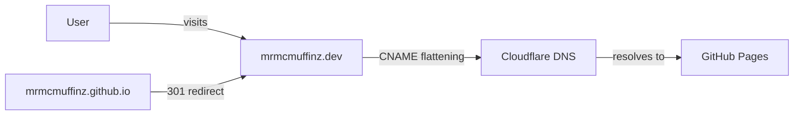
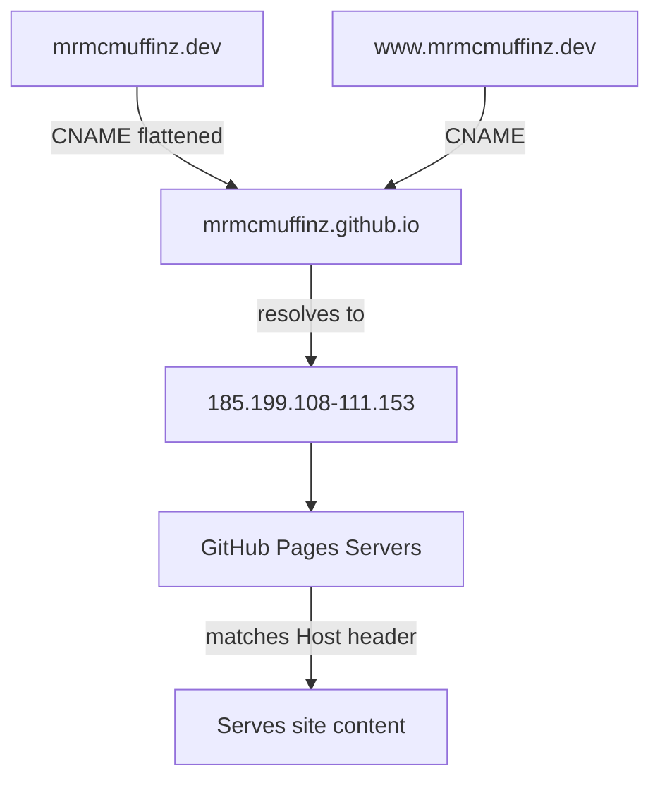
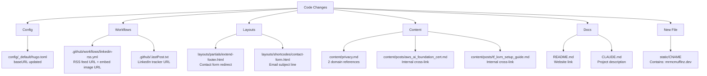
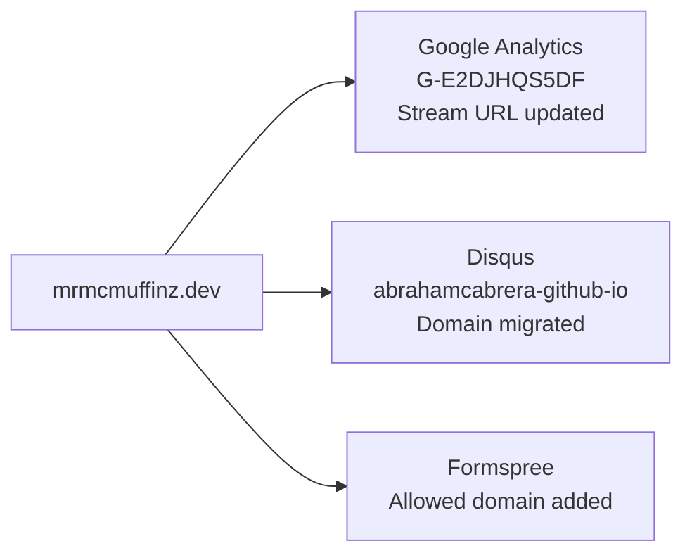
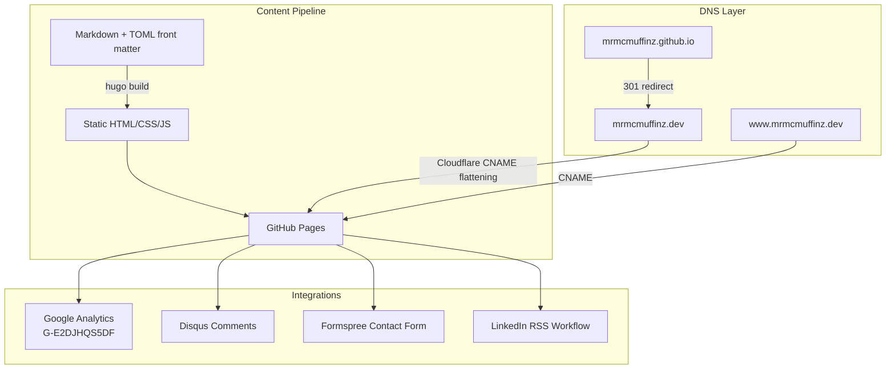

# Domain Migration: mrmcmuffinz.github.io to mrmcmuffinz.dev

**Date:** 2026-04-02
**Author:** Abraham Cabrera (with Claude Code)

---

## Overview

Migrated the personal Hugo blog from the default GitHub Pages domain (`mrmcmuffinz.github.io`) to a custom Cloudflare-registered domain (`mrmcmuffinz.dev`). The site continues to be hosted on GitHub Pages with Hugo and the Blowfish theme.

---

## What Changed

### DNS Configuration (Cloudflare)

Two CNAME records were added in Cloudflare with **DNS only** mode (grey cloud, not proxied):

| Type  | Name  | Value                        | Proxy Status |
|-------|-------|------------------------------|--------------|
| CNAME | `@`   | `mrmcmuffinz.github.io`     | DNS only     |
| CNAME | `www` | `mrmcmuffinz.github.io`     | DNS only     |

Cloudflare's CNAME flattening handles the apex domain automatically, avoiding the need for hardcoded A/AAAA records.

### GitHub Pages Settings

- Custom domain set to `mrmcmuffinz.dev` in repo Settings > Pages
- Enforce HTTPS enabled
- GitHub automatically handles 301 redirects from `mrmcmuffinz.github.io` to `mrmcmuffinz.dev`

### Repository Code Changes

All references to `mrmcmuffinz.github.io` were replaced with `mrmcmuffinz.dev` across 11 files:

#### File-by-File Summary

| File | Change |
|------|--------|
| `config/_default/hugo.toml` | `baseURL` updated to `https://mrmcmuffinz.dev/` |
| `.github/workflows/linkedin-rss.yml` | `feed_list` and `embed_image` URLs updated |
| `.github/.lastPost.txt` | Tracked post URL updated |
| `layouts/partials/extend-footer.html` | Contact form success redirect URL updated |
| `layouts/shortcodes/contact-form.html` | Hidden `_subject` field updated |
| `content/privacy.md` | Two domain references updated |
| `content/posts/aws_ai_foundation_cert.md` | Internal cross-link to CCP post updated |
| `content/posts/tf_kvm_setup_guide.md` | Internal cross-link to KVM guide updated |
| `README.md` | Website link updated |
| `CLAUDE.md` | Project description updated |
| `static/CNAME` | **Created** -- Hugo copies this to site root at build time |

### Third-Party Service Updates

#### Google Analytics (GA4)

- **Measurement ID:** `G-E2DJHQS5DF` (unchanged)
- **Action:** Updated the web stream URL from `mrmcmuffinz.github.io` to `mrmcmuffinz.dev` in GA4 Admin > Data Streams

#### Disqus

- **Shortname:** `abrahamcabrera-github-io` (unchanged)
- **Actions:**
  - Updated Website URL to `https://mrmcmuffinz.dev/`
  - Added `mrmcmuffinz.dev` to Trusted Domains
  - Used the **Domain Migration Tool** to remap all existing comment threads from old URLs to new URLs

#### Formspree

- Added `mrmcmuffinz.dev` to allowed domains for the contact form endpoint (`f/mdkyryjn`)

---

## Verification Checklist

- [x] `https://mrmcmuffinz.dev/` loads with HTTPS
- [x] `https://mrmcmuffinz.github.io/` redirects (301) to `https://mrmcmuffinz.dev/`
- [x] Disqus comments appear on posts (after domain migration tool processing)
- [x] Google Analytics tracking active on new domain
- [x] Formspree contact form accepts submissions from new domain
- [ ] LinkedIn RSS workflow picks up new feed URL on next scheduled run

---

## Architecture Reference

---

## Key Decisions

| Decision | Rationale |
|----------|-----------|
| CNAME flattening instead of A/AAAA records | Simpler setup; auto-follows if GitHub changes IPs |
| DNS only (no Cloudflare proxy) | Avoids SSL conflicts with GitHub Pages' own certificate |
| Disqus Domain Migration Tool over URL Mapper CSV | Automatic remapping; less error-prone than manual CSV editing |
| `static/CNAME` instead of repo root `CNAME` | Hugo copies `static/` contents to site root at build; keeps repo clean |
